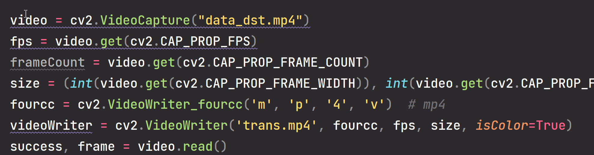
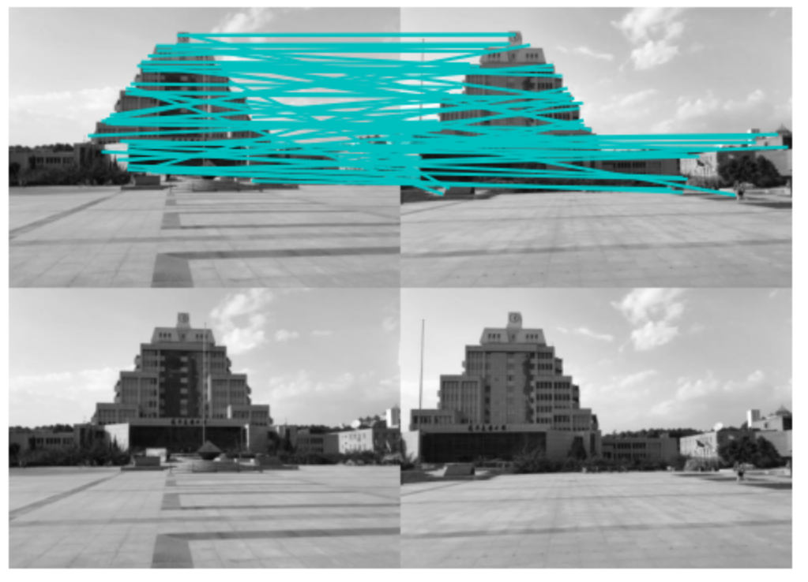

[toc]

# 视觉大实验报告

## 实验一:年龄估计

### 实验要求

利用我们先前的年龄估计的数据集进行年龄估计 

• 1）通过Mindspore/Pytorch实现我们给定的网络结构实现年龄估计； 

### 实验原理

卷积神经网络:


### 实验内容

按照上表初始化各层:


逐层执行:


完善执行细节:


计算步长和梯度更新模型：


### 实验结果

见custom.txt

## 实验三:人脸替换

### 实验要求

拍摄一段包含人脸视频，替换视频中的人脸： 

• 1）手动对视频的人脸进行关键点的标注； 

• 2）利用我们上课讲解的光流，对关键点的运动在相邻的视频帧中进行传播； 

• 3）对待替换的人脸的关键点进行定义； 

• 4）通过学习的分段线性几何变换将人脸替换到视频中； 

• 5）Bonus加分，大家可以参加DeepFake进行换脸实验。

### 实验原理

为了获得更为准确的关键点,使用dlib模型获取人脸的68个特征点.

使用三角面片仿射变换将target的人脸换到提取出的帧中.

计算mask并计算泊松融合.

使用光流函数获得下一帧的关键点.

将修改后的帧拼接成视频.

值得一提的是:如果新的帧的特征点只来自于光流函数, 在3~7帧之后就会出现明显的偏差, 所以本实验采用dlib与光流函数结合的方法. 每隔5帧使用dlib获取准确的特征点, 其余时刻均使用光流函数来计算特征点.

### 实验内容

1.使用cv2库的函数读取视频并获得帧:



2.使用dlib获取特征点


3.进行三角面片计算


4.泊松融合


5.获取下一帧的特征点:


6.重复上述计算直到所有帧均处理完毕

### 实验结果

只使用光流函数效果:

这里我们将钢铁侠的脸换到美国队长的脸上,在第一帧有着良好的效果如下图:


但在大约25帧过后, 由于多次调用光流函数的累计误差, 视频中的换脸效果已经十分畸形.


如果使用光流函数与dlib结合的方式:


可以看到在运行一段时间过后, 换脸的效果并不显得太过畸形.

### bonus:deepfacelab

deepfacelab：

* source和target视频拆分成帧并分别提取人脸
* 将提取的人脸分类，除去不需要训练的人脸
* 使用模型

源视频：


目标视频：


deepfacelab使用的是深度学习，换脸效果会比我们的实验方案好的原因在于

* deepfacelab是两段视频之间的换脸，可以获得更加自然的脸部细节，如果是本实验中一样，当人物有表情时，则换脸效果十分不自然。
* deepfacelab可以手动调整迭代的次数，获得恰到好处的换脸结果。
* deepfacelab可以调整肤色等参数，使用调整好的参数来生成视频

调整好的参数：


换脸后效果


## 实验六:图像融合

### 实验原理

计算得到图像的特征点和特征向量之后, 匹配两张图片的特征点, 将图片视角变化后, 将两张图片拼接.

### 实验内容

```python
    def stitch(self, images, ratio = 0.75, reprojThresh = 4.0, showMatches = False):
        # 读取图像
        imageB, imageA = images
        # 计算特征点和特征向量
        kpsA, featureA = self.detectAndDescribe(imageA)
        kpsB, featureB = self.detectAndDescribe(imageB)

        # 匹配两张图片的特征点
        M = self.matchKeypoints(kpsA, kpsB, featureA, featureB, ratio, reprojThresh)

        # 没有匹配点，退出
        if not M:
            return None

        matches, H, status = M
        # 将图片A进行视角变换 中间结果
        result = cv2.warpPerspective(imageA, H, (imageA.shape[1] + imageB.shape[1], imageA.shape[0]))
        # 将图片B传入]
        result[0:imageB.shape[0], 0:imageB.shape[1]] = imageB
        self.cv_show('result', result)

        # 检测是否需要显示图片匹配
        if showMatches:
            # 生成匹配图片
            vis = self.drawMatches(imageA, imageB, kpsA, kpsB, matches, status)
            # 返回结果
            return result, vis

        # 返回匹配结果
        return result
```

### 实验结果

原图片:


特征点匹配:


拼接结果


## 实验六:图像Harris角点检测和匹配

### 实验原理

Harris角点检测

### 实验内容

harris角点检测:


匹配:


### 实验结果



## 源代码

详细代码均位于code文件夹中.
